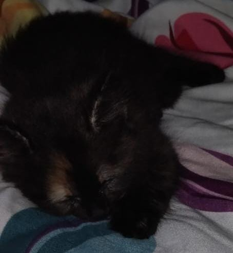
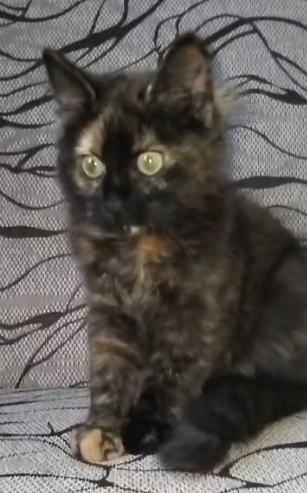
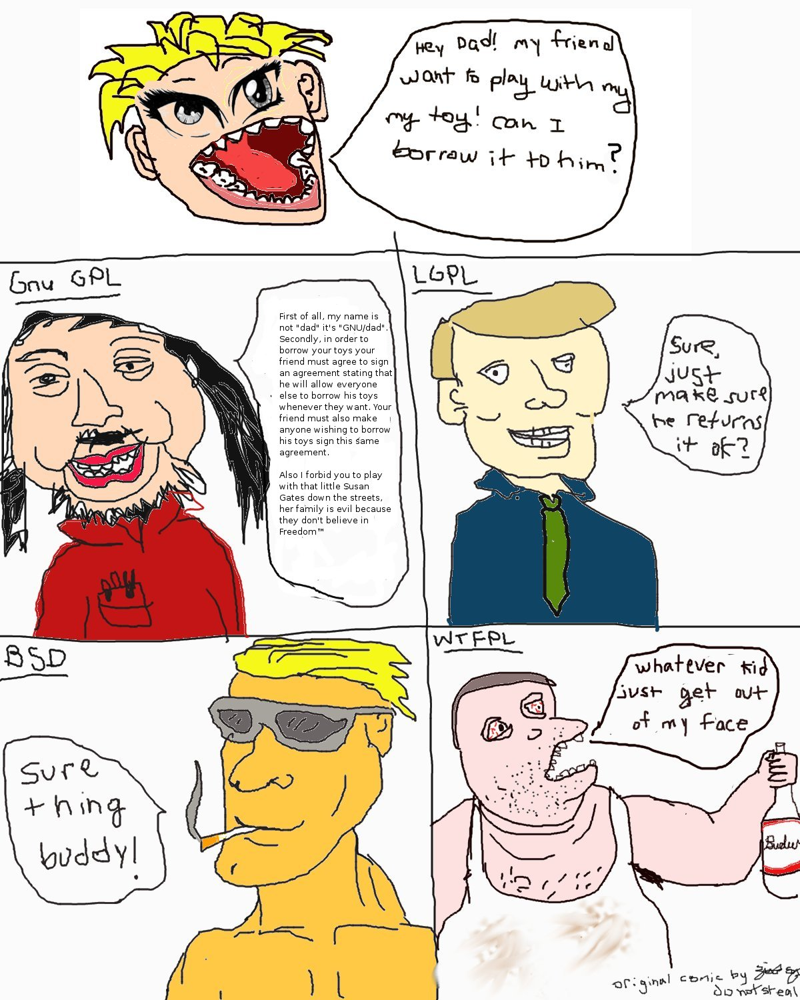

# GoshkikOS

The GoshkikOS project (formerly ShitOS) is an operating system targeting x86_64. 
GoshkikOS is my first real attempt at doing OSDev, so it's bad.
This project serves as a learning project for me, I hope to stick with it.

The project is licensed under WTFPL (DO WHAT THE FUCK YOU WANT TO PUBLIC LICENSE)

# Installation

To clone/build this project, follow these instructions:

```
  git clone https://github.com/Poptart69420/GoshkikOS.git
  cd GoshkikOS
  git clone https://github.com/Poptart69420/gcc.git cross_compiler/gcc
  git clone https://github.com/Poptart69420/binutils-gdb.git cross_compiler/binutils-gdb
  ./cross_compile.sh
  ./build.sh
```

Then you can run it with one of my premade qemu scripts with:

```

./qemu-run.sh

```

Or:

```

./qemu-run-with-debugger.sh

```

To run it with the debugging output.


# Completed (Git Repo)

- Added a proper readme (still being updated over time)

- Added an installation/build guide

- Added a license that reflects the FLOSS (Free Libre Open Source Software) ideals of this project


## - To-Do (Git Repo)

- Add a list of dependencies (trying to keep the list minimal)

- Add some documentation


# Completed (Actual Project)

- Cross compiler setup

- Build scripts

- Run scripts

- GDT setup

- ISR/IDT/IRQ setup (minimal)

- Spinlock

- Virtual terminal (minimal)

- PS2 keyboard handling (minimal)
 
- Finished paging (memmap, pmm, vmm)

- VFS (FS modularity layer)

- Tmpfs (pretty much finished, just missing access time and proper attribute handling)

## - To-Do (Actual Project)

- Modular device handling

- Modular driver loader

- Persistant file systems

- Expanded memory management

- Scheduling

- PS2 mouse handling

- Expanded PS2 keyboard handling

- And a fucking wholeeee lot more

## - WTFPL License

```
            DO WHAT THE FUCK YOU WANT TO PUBLIC LICENSE
                    Version 2, December 2004

 Copyright (C) 2004 Sam Hocevar <sam@hocevar.net>

 Everyone is permitted to copy and distribute verbatim or modified
 copies of this license document, and changing it is allowed as long
 as the name is changed.

            DO WHAT THE FUCK YOU WANT TO PUBLIC LICENSE
   TERMS AND CONDITIONS FOR COPYING, DISTRIBUTION AND MODIFICATION

  0. You just DO WHAT THE FUCK YOU WANT TO.

```

## Goshkik Sleepy



## Goshkik WHAT



## Drawing Of Goshkik


## WTFPL Logo


## WTFPL Comic Strip


